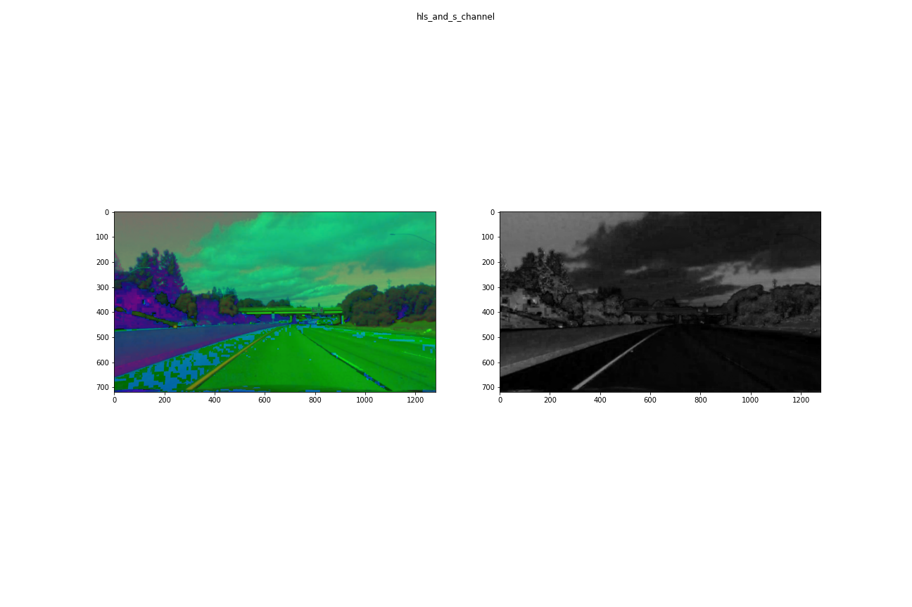

## Advanced Lane Finding

The Project
---

The steps implemented as part of this project are the following:

* Compute the camera calibration matrix and distortion coefficients given a set of chessboard images.
* Apply a distortion correction to raw images.
* Use color transforms, gradients, etc., to create a thresholded binary image.
* Apply a perspective transform to rectify binary image ("birds-eye view").
* Detect lane pixels and fit to find the lane boundary.
* Determine the curvature of the lane and vehicle position with respect to center.
* Warp the detected lane boundaries back onto the original image.
* Output visual display of the lane boundaries and numerical estimation of lane curvature and vehicle position.

The Pipeline
---
* Compute camera calibration using chess board images in `./calib_images` folder
  * Sample test output image is shown below
  
  
* Undistort the image

* Color and x-gradient(Sobel) thresholding 
  * HLS(Hue Saturation Value) color space
  
  
  * LAB(black/white green/red Blue/yellow)
  
  
  * LUV for white lanes
  
  
  * Gradient thresholding
  
  * Combining all thresholds
  
  
* Polygon mask
  * Once a thresholded binary image is obtained, mask the image with the desired region of interest. Since, we are working with lane lines, we need bottom half of the image and in the bottom half, we only need certain region due to the effect of perspective transform when images are captured.
   
  
* Bird's eye view
  * We need to take into account the perspective view of the image and convert it to actual(parallel lines are parallel) view to be able to effectively calculate polynomial line fit.
  * Bird's eye view of the masked image is obtained using Homography transformation between the image plane and a plane that is parallel to our eye vision.
  * Source points are obtained from the corners of the polygon displayed above. Destination points are taken to be a rectangle that of image size.
   
 
* Sliding window
  * In this step, effective pixels that constitute a line are calcualted using sliding window approach
  * First find all x and y coordinates of non-zero pixels.
  * Next, an histogram along columns is analysed to obtain the starting positions. base_xleft and base_xright of left and right lanes along the y_max of the image. A small window is fitted around these starting positions. Since, we know that the lines move up, we expand the current window along xdirection by margin amount and shift the window up.
  * Get coordinates of non-zero pixels in this window. Update the base_x* position according to pixels in this window.
  * Repeat this process for number of windows defined.
    [Sliding Windows](./output_images/sliding-windows-on-warped-image.png)
 
* Polyfit
  * Once the effective pixels are obtained, 2nd degree polynoimal is fitted to these pixel coordinates to obtain line equation coefficients.
  * Fill the region inside the lanes to mark the region of interest
   

* Radius of curvature and vehicle position w.r.t lane center
  * Radius of curvature is calculated according to the formula [radius of curvature](https://en.wikipedia.org/wiki/Radius_of_curvature)
  * Separate curvature is calulated and then averaged for the two lanes
  * The vehicle center(camera center) is the image's center. The bottom of the image, gives the location of the vehicle's center with respect to lane center(average of offset coefficients from the lane fit coefficients of left and right lanes)
  
* Warp back onto image plane
  

* Overlay on input image
  
  
Notes
---
* There are couple of drawbacks of each thresholding method. Gradient thresholding fails in the challenge video where a black patch on the road is interpreted as a gradient change(i.e. not smooth region or an edge along y-axis). This would cause unwanted effects.

* Since the algorithm heavily depends on the ability to threshold images accurately, it can be broken easily.
* In the hard challenge video, the curvature is too much and the yrange=[image_height-100:image_height] pixels are blocked by the vehicle's front bumper. Hence, this has to be accounted separately.
* Also, the length of the polygonal mask had to be decreased for hard challenge video as the curves were too curvy. This shows that a limitation of the current algorithm would be scalability to different scenarios.

Output videos
---

* project video output

* challenge video output

* harder challenge video output

