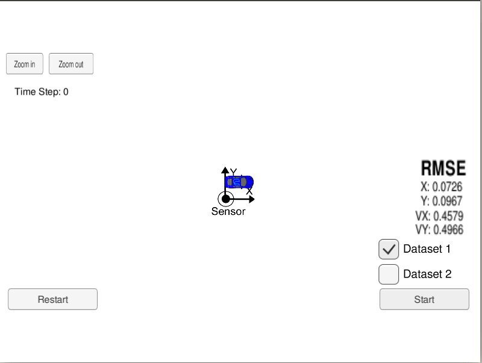
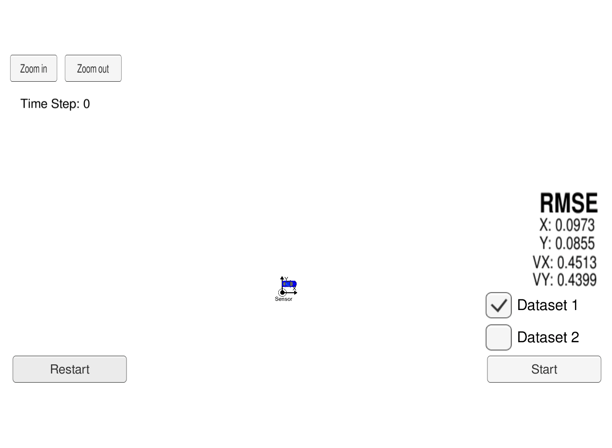
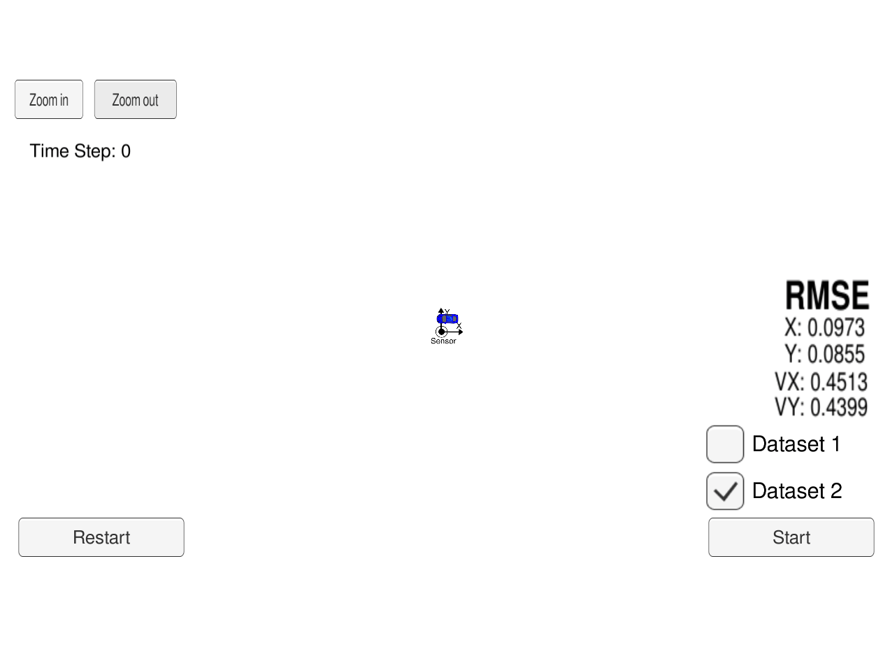
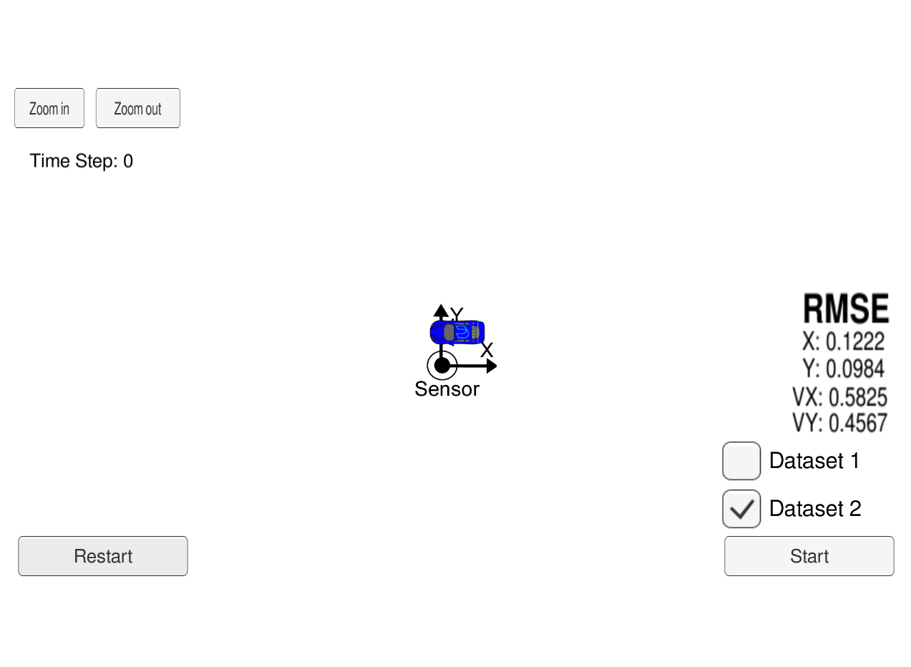
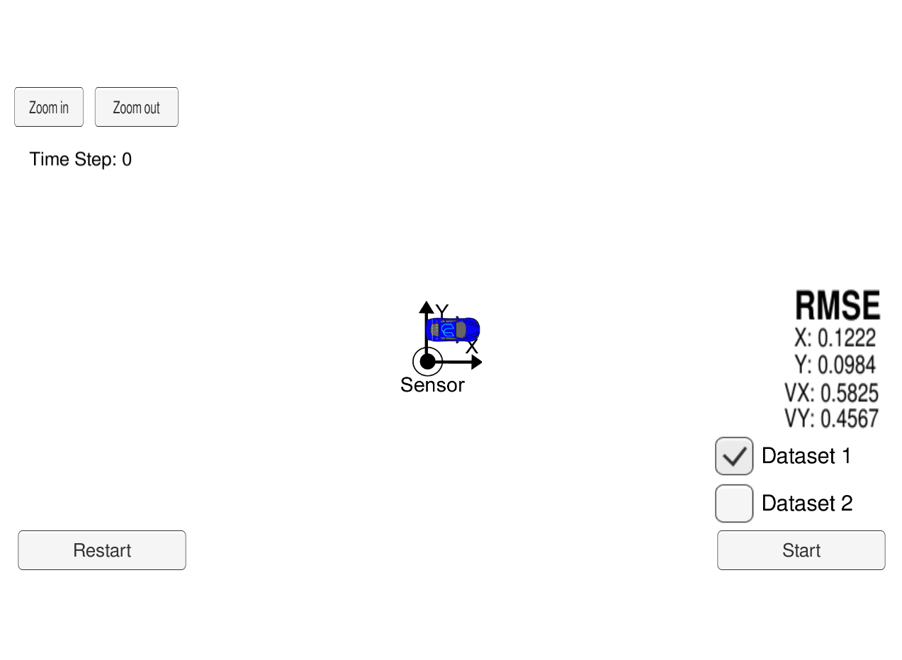

## Extended Kalman Filter

Here, I utilize a kalman filter to estimate the state of a moving object of interest with noisy lidar and radar measurements. 

#### Sample output:
Blue dots indicate Radar measurements, Red dots indicates Lidar measurements and green triangles indicate EKF estimates.

This project involves the Term 2 Simulator which can be downloaded [here](https://github.com/udacity/self-driving-car-sim/releases).

This repository includes two files that can be used to set up and install [uWebSocketIO](https://github.com/uWebSockets/uWebSockets) for either Linux or Mac systems. For windows you can use either Docker, VMware, or even [Windows 10 Bash on Ubuntu](https://www.howtogeek.com/249966/how-to-install-and-use-the-linux-bash-shell-on-windows-10/) to install uWebSocketIO. Please see the uWebSocketIO Starter Guide page in the classroom within the EKF Project lesson for the required version and installation scripts.

Once the install for uWebSocketIO is complete, the main program can be built and run by doing the following from the project top directory.

1. `mkdir build`
2. `cd build`
3. `cmake ..`
4. `make`
5. `./ExtendedKF`

**INPUT**: values provided by the simulator to the c++ program

["sensor_measurement"] => the measurement that the simulator observed (either lidar or radar)

**OUTPUT**: values provided by the c++ program to the simulator

["estimate_x"] <= kalman filter estimated position x

["estimate_y"] <= kalman filter estimated position y

["rmse_x"]

["rmse_y"]

["rmse_vx"]

["rmse_vy"]

---

## Other Important Dependencies

* cmake >= 3.5
  * All OSes: [click here for installation instructions](https://cmake.org/install/)
* make >= 4.1 (Linux, Mac), 3.81 (Windows)
  * Linux: make is installed by default on most Linux distros
  * Mac: [install Xcode command line tools to get make](https://developer.apple.com/xcode/features/)
  * Windows: [Click here for installation instructions](http://gnuwin32.sourceforge.net/packages/make.htm)
* gcc/g++ >= 5.4
  * Linux: gcc / g++ is installed by default on most Linux distros
  * Mac: same deal as make - [install Xcode command line tools](https://developer.apple.com/xcode/features/)
  * Windows: recommend using [MinGW](http://www.mingw.org/)

## Basic Build Instructions

1. Clone this repo.
2. Make a build directory: `mkdir build && cd build`
3. Compile: `cmake .. && make` 
   * On windows, you may need to run: `cmake .. -G "Unix Makefiles" && make`
4. Run it: `./ExtendedKF `

If you'd like to generate your own radar and lidar data, see the
[utilities repo](https://github.com/udacity/CarND-Mercedes-SF-Utilities) for
Matlab scripts that can generate additional data.

## Experiments and Observations

### Experiments

1. In the [simulator](https://github.com/udacity/self-driving-car-sim/releases), for dataset-1, the first measurement is observed from Lidar and the output is as follows:

2. In the [simulator](https://github.com/udacity/self-driving-car-sim/releases), for dataset-2, the first measurement is observed from Radar and the output is as follows:

3. In this experiment, I've skipped measurement for Lidar data. So, only Radar data is considered for estimation.

4. In this experiment, I've skipped measurement for Radar data. So, only Lidar data is considered for estimation.

### Observations

1. Consider Experiment 1 and Experiment 4: 
  - We can see that there is an increase in the RMSE value of all state variables.
  - However, this increase is not too high.
  - This suggests that Radar data is not adding too much value to the estimates
2. Consider Experiment 2 and Experiment 3:
  - We can see that the increase in RMSE is very high compared to observation-1's experiements.
  - This suggests that Lidar data is adding a lot of weight for correct estimates.
3. Also, consider Experiment 1 and Experiment 2
  - RMSE values of experiment-1 are almost the same as in experiment-2 i.e. lets say in the range of error.
  - Thus, it does not matter whether we are getting Lidar measurement first or radar measurement.
