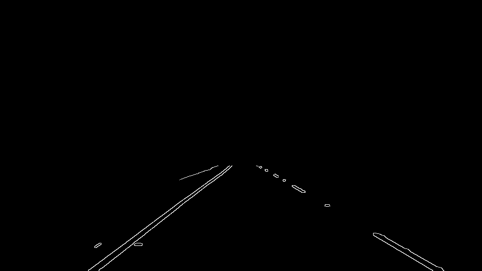

# **Finding Lane Lines on the Road** 
This project is part of Udacity's self-driving NanoDegree program. In this project, I demonstrate lane detection using Hough lines. Here, we can see that although, this algrithm works well on two sample videos, it isn't good enough for the third video. The ouput can be seen below.

### Pipeline

Input Image is as shown below.

My pipeline consisted of 7 steps.

- Convert Image to Grayscale. This is required for canny edge detection algorithm.

- Dilate the image for better edge detection.

- Gaussian Blur the image to remove high frequency noise.

- Apply Canny Edge detection algorithm from opencv.

- Create a polygonal area to limit the edges under consideration to region where lanes are important for the current task.

- Apply Hough transform and fit line. Here, I have considered the following heuristic to obtain solid lane lines as seen.
1. left lanes have positive slope and right lanes have negative slope
2. threshold the magnitude of slopes within certain region, for eg- between 26 and 63 deg.
3. find average slope of left lanes and right lanes
4. average all points along the left and right region to calculate the average intercept
5. Now, calculate the end points of the lanes using the above calculated slope and intercept values.
6. Also, if at any time, either left or right lines are not found, use previous images' values.

- Overlay the lines on the input image

### Shortcomings

- An important shortcoming in this approach is that it would fail in curvy roads. We would not know if a road is curved if we deploy this algo and start driving :)
- Too many thresholding and heuristics making it difficult to work in other driving conditions such as rainy, cloudy, too sunny, snowy, etc.
- If edge detection fails, the algorithm also fails as it is built on edge detection. 

### Possible improvements

- Not rely on edges. For eg, use both color thresholding and edge detection to improve the robustness.
- Need to use a generic curve fitting like polyfit to better predict on curved roads.
- More pre-processing to maintain a constant brightness and contrast across frames. 

## Gifs of 3 sample videos

Now, the below gif shows how the lane detection algorithm that worked nice for the above videos, need not work the same here as well. The roads are more curvy, making straight line prediction based algos to fail. i.e. linear line wouldn't suffice.

